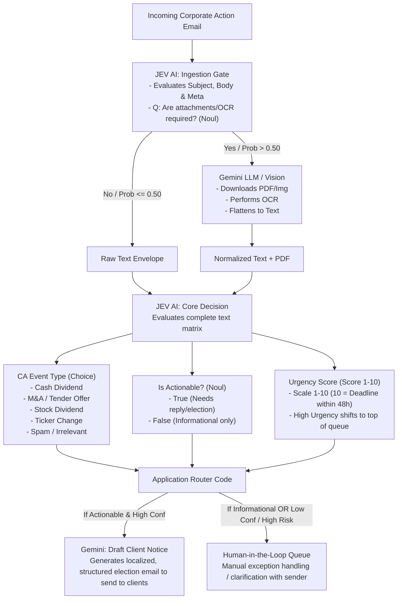

# ⚡ Jev AI Email Flow Automation & Corporate Actions Solution

An intelligent email parsing, classification, document OCR, and workflow automation system powered by **Jev AI** (`typesafe-sdk`), TypeSafe AI's **System One** decision engine, and **Gemini LLM / Vision**.

Unlike traditional large language models (LLMs) that slowly generate text or prose, **Jev AI** is engineered specifically as an ultra-fast, structured decision layer. It consumes application state and produces typed, calibrated decisions (`Choice`, `Score`, `Noul`) in milliseconds (~50–100ms).

---

## 🏛️ End-to-End Corporate Actions Flow Architecture



---

## 📦 Jev AI Payload Contracts

### 1. Stage 1: Ingestion Gate Payload to Jev
```json
{
  "context": "From: proxy-alerts@custodian.com\nSubject: Urgent: Action Required for ABC Corp Merger\nBody: Please review the attached corporate proxy document for restructuring options.",
  "questions": {
    "requires_heavy_ocr": {
      "type": "Noul",
      "description": "True if the context lacks actionable dates/terms and explicitly points to an attached PDF or image file for full details."
    }
  }
}
```

### 2. Stage 3: Core Decision Payload to Jev
```json
{
  "context": "[Email Body + Flattened Attachment Text]",
  "questions": {
    "event_type": {
      "type": "Choice",
      "choices": ["Cash_Dividend", "Stock_Dividend", "Merger_Acquisition", "Ticker_Change", "Spam_Or_Irrelevant"]
    },
    "is_actionable": {
      "type": "Noul",
      "description": "True if our operations desk must respond, submit an election, or alert clients. False if it is just an FYI update."
    },
    "urgency": {
      "type": "Score",
      "description": "Scale 1-10 of how critical the timeline is. A 10 means the deadline is within 48 hours."
    }
  }
}
```

---

## 🎯 Primitives & Decisions

| Stage | Primitive | Question | Meaning & Behavior |
| :--- | :--- | :--- | :--- |
| **Ingestion Gate** | `Noul` | `requires_heavy_ocr` | Calibrated probability ($0.0 \rightarrow 1.0$) whether attachments need Gemini OCR. If $> 0.50$, executes Gemini OCR. If $\le 0.50$, proceeds with Raw Text Envelope. |
| **Core Decision** | `Choice` | `event_type` | Classifies into `Cash_Dividend`, `Stock_Dividend`, `Merger_Acquisition`, `Ticker_Change`, or `Spam_Or_Irrelevant`. |
| **Core Decision** | `Noul` | `is_actionable` | Calibrated probability whether operational desk must respond or submit client election vs. informational FYI. |
| **Core Decision** | `Score` | `urgency` | 10-point scale of timeline criticality ($10 = \text{within 48 hours}$). High Urgency shifts items to top of operational queue. |
| **Router** | Code | Branching | If `is_actionable` & high confidence $\rightarrow$ **Gemini: Draft Client Notice**.<br/>If informational OR low confidence / high risk $\rightarrow$ **Human-in-the-Loop Queue**. |

---

## 📂 Corporate Actions Email Dataset

The dataset in `data/corporate_actions_emails/` includes:

| Filename | Format | Event Type / Notice | Custodian / Source |
| :--- | :--- | :--- | :--- |
| `00_urgent_merger_attached_proxy.eml` | `.eml` + `.pdf` | **M&A Restructuring** (Refers to attached proxy PDF; triggers Stage 2 OCR) | Custodian Alerts |
| `01_voluntary_tender_offer_deadline.eml` | `.eml` | **Voluntary Tender Offer** (Strict 24-48h cutoff, cash vs stock) | BNY Mellon |
| `02_cash_dividend_declaration.eml` | `.eml` | **Mandatory Cash Dividend** (Novo Nordisk DKK 6.40, withholding tax) | Euroclear |
| `03_rights_issue_subscription.json` | `.json` | **Voluntary Rights Issue** (1-for-4 rights subscription at 420p) | Citigroup |
| `04_forward_stock_split_3_for_1.eml` | `.eml` | **Mandatory Stock Split** (3-for-1 split, ledger adjustment) | DTCC |
| `05_proxy_voting_agm_resolutions.json` | `.json` | **Proxy Voting AGM** (Board elections, ESG climate resolutions) | Broadridge |
| `06_spinoff_distribution_new_isin.eml` | `.eml` | **Mandatory Spin-Off** (New ISIN security master setup required) | J.P. Morgan |
| `07_custodian_reconciliation_break.eml` | `.eml` | **Critical Break** ($60,000 dividend withholding tax variance) | Northern Trust |
| `08_optional_dividend_scrip_cash.json` | `.json` | **Mandatory with Choice** (Cash vs Scrip dividend election) | BNP Paribas |
| `09_capital_reduction_notice.eml` | `.eml` | **Capital Reduction** (Par value reduction & cash return) | HSBC Custody |
| `10_unsolicited_financial_newsletter_spam.txt` | `.txt` | **Financial Spam** (High-yield algorithmic trading bot pitch) | External Spam |

---

## 🚀 Quickstart

### 1. Prerequisites
- Python 3.10+ (tested on Python 3.13)
- Windows / macOS / Linux

### 2. Install Dependencies
```bash
pip install -r requirements.txt
```

### 3. Generate Datasets
```bash
python -m src.dataset_generator --dataset corporate_actions
```

### 4. Launch the Streamlit Dashboard
```bash
python -m streamlit run app.py
```
*(Or double-click [run_app.bat](file:///c:/Repo/jev-ai-emails-flow/run_app.bat))*

Open your browser at `http://localhost:8501`.

---

## 🧪 Running Automated Tests

Run the full pytest suite:
```bash
python -m pytest tests/ -v
```
*(Or double-click [run_tests.bat](file:///c:/Repo/jev-ai-emails-flow/run_tests.bat))*

All 19 tests verify:
- Ingestion Gate OCR evaluation (`requires_heavy_ocr` Noul).
- Gemini OCR document flattening and normalization into envelope matrix.
- Jev Core Decision matrix (`event_type`, `is_actionable`, `urgency` on 1-10 scale).
- Router execution: Actionable $\rightarrow$ Gemini Draft Client Notice.
- Router execution: Informational / Exceptions $\rightarrow$ Human-in-the-Loop Queue.
- Priority queue ordering by Urgency Score.
- Backward compatibility with legacy desk routing.
